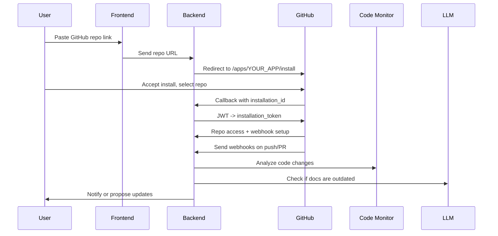

# 📘 DocSync Agent Project Documentation

## 🧩 Overview

This project aims to create an AI-powered collaborative documentation assistant that integrates deeply with GitHub repositories. It automatically tracks changes to a codebase and flags outdated documentation, offering suggestions or automatic edits based on LLM reasoning. The user only needs to provide a GitHub repository link, and the system takes care of everything else via a secure GitHub App integration.

---

## 🎯 Key Features

- One-click GitHub integration with repo-limited OAuth scope
- Automated webhook setup — no manual webhook configuration needed
- GitHub App to track changes (commits, PRs, deletions)
- Repo-aware LLM-powered doc update engine
- Notifications for stale code references in docs
- Auto-edit suggestions or approvals
- Accepts markdown-based documentation edits

---

## 🧠 GitHub App Integration Explained

### What is a GitHub App?

A GitHub App is the official, secure way to interact with GitHub repositories with fine-grained access and webhook automation.

### Why GitHub Apps Are Ideal

- Can be installed per-repo
- Fine-grained permissions (e.g., read code, write webhook)
- Automatically register webhooks
- Use JWT + installation token instead of full user tokens

---

## 🔧 Implementation Plan

### Phase 1: Project Setup

- [ ] ✅ Set up FastAPI backend
- [ ] ✅ Set up GitHub App via GitHub UI

  - App Name
  - Homepage URL
  - Callback URL
  - Webhook URL
  - Private Key Download

### Phase 2: GitHub App Authentication

- [ ] ✅ Generate JWT from App Private Key
- [ ] ✅ Use JWT to request Installation Token
- [ ] ✅ Use installation token to pull code, set webhooks, etc.

### Phase 3: Webhook Infrastructure

- [ ] ✅ Create `/webhooks/github` endpoint to receive webhook events
- [ ] ✅ Validate webhook signature using shared secret
- [ ] ✅ Respond to `push`, `pull_request`, and other relevant events

### Phase 4: Code Change Tracker

- [ ] ✅ Pull updated codebase using installation token
- [ ] ✅ Parse code structure (AST/diff)
- [ ] ✅ Track outdated mentions in documentation (e.g., function name changes)

### Phase 5: LLM-Driven Doc Checker

- [ ] ✅ Use LLM to re-verify documentation consistency
- [ ] ✅ Auto-annotate mismatches or stale comments
- [ ] ✅ Provide suggestions or make auto-edits with approval

### Phase 6: Frontend + GitHub Integration

- [ ] ✅ Accept GitHub repo URL input
- [ ] ✅ Redirect to GitHub App Install page
- [ ] ✅ Handle OAuth redirect and extract `installation_id`
- [ ] ✅ Display tracked doc/code mapping
- [ ] ✅ Allow user feedback and manual doc edits

---

## 📦 FastAPI Tech Stack

- `fastapi` – backend framework
- `httpx` – async HTTP requests (GitHub API)
- `pyjwt` – JWT signing for GitHub App
- `pydantic` – schema validation
- `uvicorn` – server

---

## 🔐 GitHub App Authentication Flow (Deep Dive)

### Step-by-step

1. **User enters GitHub repo URL** (e.g., `https://github.com/username/repo`)
2. **Backend redirects** to `https://github.com/apps/YOUR_APP/installations/new`
3. **User selects repo and installs**
4. **GitHub redirects** to your backend callback with `installation_id`
5. **Backend generates JWT** with your private key
6. **JWT is exchanged** for an installation token
7. **Installation token is used** to:

   - Pull repo contents
   - Subscribe to webhook events
   - Access commits, PRs, file trees

---

## 🔁 Webhook Flow

---

## 📌 Milestones

### ✅ Milestone 1: GitHub App + JWT Auth

- Create and register GitHub App
- Setup FastAPI JWT auth flow

### ✅ Milestone 2: Repo + Webhook Setup

- Process `installation_id`
- Receive webhook events

### ✅ Milestone 3: Code Monitor

- Pull repo
- Monitor changes
- Compare against doc references

### ✅ Milestone 4: AI Assistance

- Feed mismatches to LLM
- Suggest edits
- Push updates if approved

### ✅ Milestone 5: User UX Flow

- Repo link input
- GitHub OAuth redirect
- View notifications and take actions

---

## 🔐 Security Notes

- All webhook payloads are signed
- GitHub App is limited to specific repo
- Installation tokens are short-lived and secure
- No long-term user token storage required

---

## ✅ Outcome

You’ll have a repo-aware AI documentation assistant that:

- Reacts to repo changes via webhook
- Flags outdated docs
- Suggests edits using LLM
- Lets user approve changes
- Requires minimal user setup (just a repo link!)

---

Let me know if you’d like code templates for JWT auth, webhook validation, or LLM integration logic.
